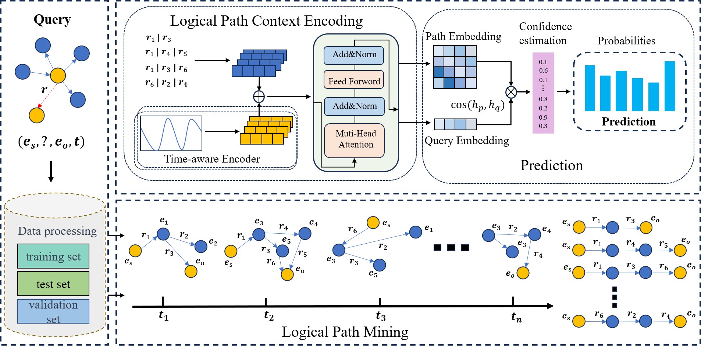

# LPCA:



## Quick Start
### Environment variables & dependencies
```
PyTorch version: 2.2.1
CUDA version used by PyTorch: 12.1
DGL version: 2.2.1

conda create -n DSTAG python=3.8
conda activate DSTAG
```

### Process data

#### For the three datasets ICEWS18, ICEWS14 and ICEWS05-15, go into the dataset folder in the ./data directory and run the following command to construct the static graph.
```
python new_dataprocess.py
```
### Train & Test models

#### 1. Train & Test models
```
python main_pre.py
```
